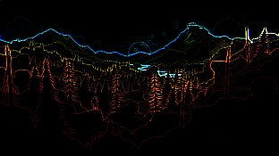

# KernelImageProcessing
This software provides methods for Kernel Image Processing, that is a set 
of image filtering techniques implemented through a kernel (i.e. a convolution mask)
and a convolution operation between a mask and an input image. The convolution 
phase can be done in parallel way, to enhance performances.

In particular this software can:

- **processing a .ppm image and coding this using C++;**
- **convolving two objects using a sequential approach;**
- **parallelizing the CPU’s work through the OpenMP library;**
- **working with a GPU as general purpose calculator in order to parallelize the convolution, using a bunch techniques for the GPU’s memory management;**
- **evaluating and comparing the results of the experiments.**

Here some examples with different kernels:

Original image.

Filtered images: from the left, <b>blur</b>, <b>boxBlur</b>, <b>edge</b> and <b>sharpen</b>

The results showed a huge speed up in every parallel
situation: a boost of 3x was achieved with OpenMP, while
with CUDA it was even greater, up to 8x.